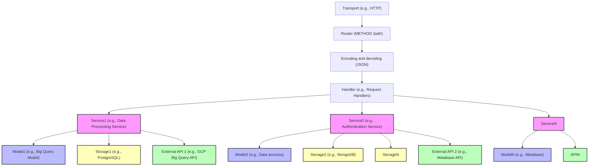

# nada-backend

nada-backend is the API behind the "NAV Data" website. 

It serves a REST-API for managing data products, and provides functionality for self-service access to the data 
source.

## Running locally with tendrils into Google (as a Nada-member)

First ensure that you're authenticated with Google.
This assumes that you have `gcloud` installed, and that [Google Cloud Platform has been enabled in myapps](https://doc.nais.io/basics/access/#google-cloud-platform-gcp).

We require the login to be done in two steps now, apparently.
```bash
gcloud auth login --update-adc
```

Ensure that your `.env` file is populated with data.
Ignore this step if there's already some data that looks right.


This assumes that `kubectl` is installed and set up with [`KUBECONFIGS`](https://doc.nais.io/basics/access/#install-kubectl), and that [naisdevice](https://doc.nais.io/device/) is installed and running.
This pulls secret data from a Kubernetes cluster and puts it into your `.env` file. 
```bash
make env
```

And ensure that `test-sa.json` exists and has contents.
Ignore this step if the file exists with data.

```bash
make test-sa
```

Start the local database
```bash
docker-compose up
```
Appending a `-d` flag in the above command detaches the process once the database stuff is running.


Then start the backend!
```bash
make local-with-auth
```

Now you can head over to the nada-frontend repository and learn how to start the frontend.

## Deployment
The application needs two GCP service accounts which are mounted in at runtime from two secrets in Google Secret Manager. These are:

- `nada-backend-google-credentials`
- `nada-backend-metabase-sa`

It also needs a GCP project where the BigQuery API is enabled to host keys for pseudonymization. 

The following values used by the application are also stored in Google Secret Manager in the secret `nada-backend`:

```
CLIENT_ID
CLIENT_SECRET
GITHUB_READ_TOKEN
GOOGLE_ADMIN_IMPERSONATION_SUBJECT
METABASE_PASSWORD
METABASE_USERNAME
SLACK_URL
```

## Architecture


