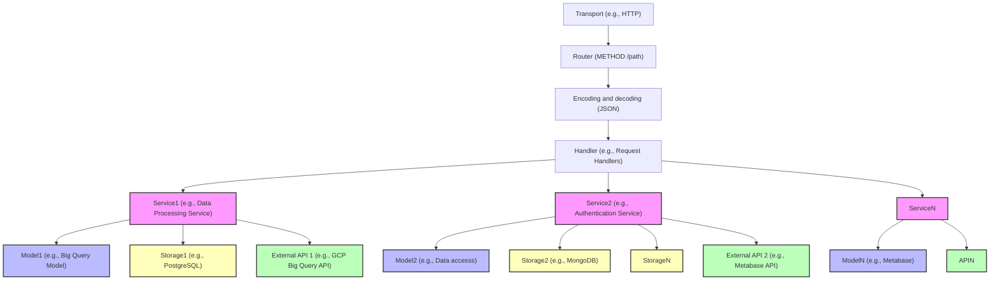

# Data management API for NAV

It serves a REST-API for managing data products, and provides functionality for self-service access to the data source.

## Getting started with local development

1. Install required dependencies

- https://clang.llvm.org
- https://docs.docker.com/engine/install/
- https://cloud.google.com/sdk/gcloud
- https://kubernetes.io/docs/tasks/tools/#kubectl

2. Configure `gcloud` so you can [access Nais clusters](https://doc.nais.io/operate/how-to/command-line-access/#google-cloud-platform-gcp)  
3. Login to GCP and configure docker
```bash
gcloud auth login --update-adc
gcloud auth configure-docker europe-north1-docker.pkg.dev 
```
4. (Optional) If you are on mac with arm (m1, m2, m3, etc.) install rosetta
```bash
softwareupdate --install-rosetta
```
5. Run som build commands

```bash
# Build all binaries
$ make build

# Run the tests
$ make test
```

## Run with fully local resources

With this configuration all dependencies run as containers, as can be seen in `docker-compose.yaml`:
- Google BigQuery using [bigquery-emulator](https://github.com/goccy/bigquery-emulator), with additional mocks for the 
  IAM Policy 
  endpoints
- Google Cloud Storage using [fake-gcs-server](https://github.com/fsouza/fake-gcs-server)
- [Metabase](https://github.com/metabase/metabase) with a [patch](resources/images/metabase/001-bigquery-cloud-sdk-no-auth.patch) for enabling use of bigquery-emulator
- Fake API servers for `teamkatalogen` and `naisconsole`

There are still a couple of services missing, though much functionality should work without this:
- Fetching of Google Groups
- Creating Google Cloud Service Accounts

1. Start the dependencies and API
```bash
# Starts the dependencies in the background, and runs the API in the foreground
$ make run
```
**Note:** building the big query emulator requires quite a bit of memory, so if you see something like `clang++:
signal: killed` you need to increase the amount of memory you allocate to your container run-time.

2. (Optional): Start the [nada-frontend](https://github.com/navikt/nada-frontend/?tab=readme-ov-file#development)

3. (Optional): Take a look at the [locally running Metabase](http://localhost:8083), the username is: `nada@nav.no`,
   and password is: `superdupersecret1`

## Making changes to the database or generated models and queries

1. [Migrations](pkg/database/migrations) allows you to modify the existing database, these are automatically applied during startup of the application
2. [Queries](pkg/database/queries) lets you generate new models and queries based on the existing structure

**NB:** If you make changes to the *Queries* remember to run the generate command so your changes are propagated:

```bash
$ make generate
```

## Update the images

We build and push images for the patched metabase and customized big-query emulator to speed up local development and integration tests. If you need to make changes to these: 

1. Make changes to the [base images](resources/images)

**Note:** in the [Makefile](Makefile) we set the target version for the mocks and Metabase.

If you change the `METABASE_VERSION` then it will pull the jar or source code for that version of Metabase and build the new images. We also use this as the version in the image tags for metabase(-patched).

If you change the mocks, you also need to bump the `MOCKS_VERSION`, so we get the latest changes.

2. Build the new images locally
```bash
$ make build-all
```
3. Push the images to the container registry
```
$ make push-all
```

## Architecture


