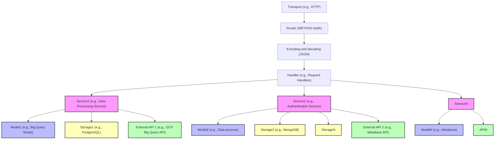

# nada-backend

nada-backend is the API behind the "NAV Data" website. 

It serves a REST-API for managing data products, and provides functionality for self-service access to the data 
source.

## Getting started with local development

1. Install required dependencies

- https://clang.llvm.org
- https://docs.docker.com/engine/install/
- https://cloud.google.com/sdk/gcloud
- https://kubernetes.io/docs/tasks/tools/#kubectl

2. Configure `gcloud` so you can [access Nais clusters](https://doc.nais.io/operate/how-to/command-line-access/#google-cloud-platform-gcp)  
3. Login to GCP
```bash
gcloud auth login --update-adc
```
4. Run som build commands

```bash
# Build all the nada-backend binaries
$ make build

# Start nada-backend with only local resources
$ make local-deps # Builds and runs dependencies in the foreground
$ make local # Builds and runs nada-backend
```

5. (Optional): Start the [nada-frontend](https://github.com/navikt/nada-frontend/?tab=readme-ov-file#development)

6. (Optional): Take a look at the [locally running Metabase](http://localhost:8083), the username is: `nada@nav.no`, 
   and password is: `superdupersecret1`

### Fully local development


## Deployment
The application needs two GCP service accounts which are mounted in at runtime from two secrets in Google Secret Manager. These are:

- `nada-backend-google-credentials`
- `nada-backend-metabase-sa`

It also needs a GCP project where the BigQuery API is enabled to host keys for pseudonymization. 

The following values used by the application are also stored in Google Secret Manager in the secret `nada-backend`:

```
CLIENT_ID
CLIENT_SECRET
GITHUB_READ_TOKEN
GOOGLE_ADMIN_IMPERSONATION_SUBJECT
METABASE_PASSWORD
METABASE_USERNAME
SLACK_URL
```

## Architecture


